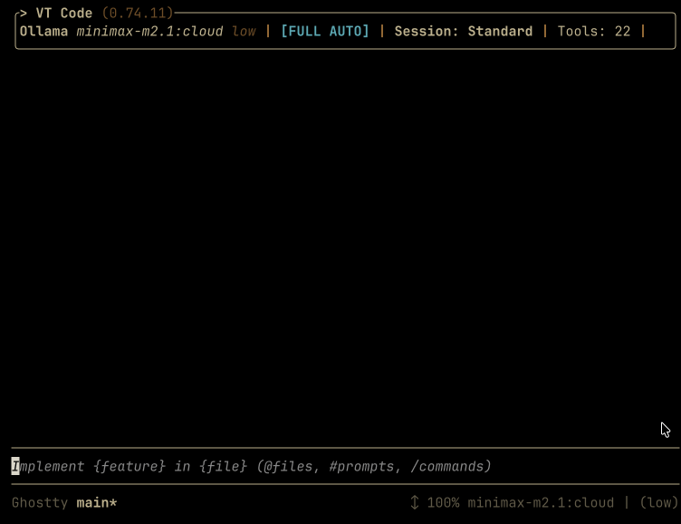

<a href="./docs/skills/SKILLS_GUIDE.md"></a> <a href="./docs/guides/zed-acp.md"></a> <a href="./docs/guides/mcp-integration.md"></a>

<a href="https://crates.io/crates/vtcode"></a> <a href="https://github.com/vinhnx/vtcode/releases"></a>

---

<strong>VT Code</strong> is an open-source coding agent with LLM-native code understanding and robust shell safety. Supports multiple LLM providers with automatic failover and efficient context management.

<p align="center">
  
</p>

---

## Installation

**Native Installer (Recommended)** - No dependencies, instant setup:

**macOS & Linux:**

```bash
curl -fsSL https://raw.githubusercontent.com/vinhnx/vtcode/main/scripts/install.sh | bash
```

**Windows (PowerShell):**

```powershell
irm https://raw.githubusercontent.com/vinhnx/vtcode/main/scripts/install.ps1 | iex
```

**Alternative Installation Methods:**

```bash
# Cargo (Rust package manager)
cargo install vtcode

# Homebrew (macOS/Linux)
brew install vinhnx/tap/vtcode
```

**See [Installation Guide](./docs/installation/) and [Native Installer Guide](./docs/installation/NATIVE_INSTALLERS.md) for more options and troubleshooting.**

## Usage

```bash
# Set your API key
export OPENAI_API_KEY="sk-..."

# Launch VT Code
vtcode
```

### AgentSkills Support

VT Code includes comprehensive support for AgentSkills, following the [open Agent Skills standard](http://agentskills.io/). AgentSkills enable VT Code to leverage external capabilities and extend its functionality through a standardized skill system.

Key features of AgentSkills support:

- **Skill Discovery**: VT Code can discover and load skills from multiple locations with precedence handling
- **Standard Compliance**: Fully compliant with the Agent Skills specification for interoperability
- **Multi-Location Support**: Skills can be loaded from local directories, remote repositories, or embedded resources
- **Extensible Ecosystem**: Integrate with the growing ecosystem of Agent Skills for enhanced capabilities

For more information about AgentSkills implementation in VT Code, see [Agent Skills Guide](./docs/skills/SKILLS_GUIDE.md).

### Supported Providers

VT Code works with OpenAI, Anthropic, Google Gemini, DeepSeek, OpenRouter, Z.AI, Moonshot AI, MiniMax, HuggingFace Inference Providers, Ollama (local & cloud), and LM Studio (local).

Set the corresponding environment variable for your provider (see [Installation Guide](./docs/installation/#supported-ai-providers) for all options).

### Agent Protocols

VT Code supports multiple agent protocols for integration:

#### Agent Client Protocol (ACP)

VT Code can integrate with code editors like Zed. To configure ACP, refer to the [ACP docs](./docs/guides/zed-acp.md).

#### Agent2Agent (A2A) Protocol

VT Code implements the [Agent2Agent (A2A) Protocol](https://a2a-protocol.org), enabling communication and interoperability between AI agents. The A2A protocol supports:

- **Agent Discovery**: Via Agent Cards at `/.well-known/agent-card.json`
- **Task Lifecycle Management**: States like `submitted`, `working`, `completed`, `failed`
- **Real-time Streaming**: Via Server-Sent Events (SSE)
- **Rich Content Types**: Text, file, and structured data parts
- **Push Notifications**: Webhook-based async updates
- **JSON-RPC 2.0**: Over HTTP(S) for interoperability

For more information about A2A protocol support, see [A2A Protocol Documentation](./docs/a2a/a2a-protocol.md).

#### Anthropic API Compatibility

VT Code provides compatibility with the [Anthropic Messages API](https://docs.anthropic.com/en/api/messages) to help connect existing applications to VT Code, including tools like Claude Code.

The server supports:

- Messages endpoint at `/v1/messages`
- Streaming responses
- Tool calling
- Vision (image) support
- Multi-turn conversations
- System prompts
- All major Anthropic API features

For more information about Anthropic API compatibility, see [Anthropic API Documentation](./docs/a2a/a2a-protocol.md).

#### Open Responses Specification

VT Code conforms to the [Open Responses](https://www.openresponses.org/) specification, an open, vendor-neutral standard for large language model APIs. This enables interoperable LLM workflows across different providers.

Key features of Open Responses conformance:

- **Unified Item Types**: State machine-based items with defined lifecycle states
- **Semantic Streaming**: Events describe meaningful transitions, not raw token deltas
- **Agentic Loop Support**: Composable tool invocation and message orchestration
- **Extension Points**: Provider-specific features via namespaced extensions (e.g., `vtcode:file_change`)

For more information about Open Responses implementation, see [Open Responses Documentation](./docs/protocols/OPEN_RESPONSES.md).

### Configuration

VT Code supports a rich set of configuration options, with preferences stored in `vtcode.toml`. Key configuration features include:

- **Lifecycle Hooks**: Execute shell commands in response to agent events - see [Lifecycle Hooks Guide](./docs/guides/lifecycle-hooks.md)
- **Tool Policies**: Control which tools are allowed, prompted, or denied
- **Security Settings**: Configure human-in-the-loop approval and workspace boundaries
- **Performance Tuning**: Adjust context limits, timeouts, and caching behavior

For full configuration options, see [Configuration](./docs/config/CONFIGURATION_PRECEDENCE.md).

### CLI Design Principles

VT Code follows the [Command Line Interface Guidelines](https://clig.dev/) and standard UNIX principles to ensure a robust and pipe-friendly experience:

- **Output Streams**: Primary output (e.g., code from `ask`, events from `exec`) is sent to `stdout`. All logs, metadata, reasoning traces, and interaction prompts are sent to `stderr`. This allows you to safely pipe `vtcode` output to other tools.
    ```bash
    # Only the generated code is saved to file; metadata remains on screen
    vtcode ask "factorial function in rust" > factorial.rs
    ```
- **Standard Arguments**: Adheres to GNU/POSIX argument parsing standards using `clap`, supporting standard flags like `--help`, `--version`, and `--` separator for positional arguments.

---

### Key Features

- **Security First**: Multi-layered security model with tree-sitter-bash command validation, execution policy, and sandbox isolation
- **Multi-Provider AI**: OpenAI, Anthropic, DeepSeek, Gemini, Z.AI, Moonshot AI, OpenRouter, MiniMax, Ollama (local)
- **Semantic Code Understanding**: LLM-native code analysis and navigation (Rust, Python, JavaScript/TypeScript, Go, Java, and more)
- **Smart Tools**: Built-in code analysis, file operations, terminal commands, and refactoring
- **Agent Skills**: Comprehensive skills location system with multi-location support and precedence handling, aligned with the [open Agent Skills standard](http://agentskills.io/) ([docs](./docs/skills/SKILLS_GUIDE.md))
- **Subagents**: Delegate tasks to specialized agents (explore/plan/general/code-reviewer/debugger) via `spawn_subagent`; see [docs/subagents/SUBAGENTS.md](./docs/subagents/SUBAGENTS.md)
- **Editor Integration**: Native support for Zed IDE via Agent Client Protocol (ACP)
- **Lifecycle Hooks**: Execute custom shell commands in response to agent events for context enrichment, policy enforcement, and automation ([docs](./docs/guides/lifecycle-hooks.md))
- **Context Management**: Advanced token budget tracking and context curation
- **TUI Interface**: Rich terminal user interface with real-time streaming

### Security & Safety

VT Code implements a **defense-in-depth security model** to protect against prompt injection and argument injection attacks:

- **Execution Policy**: Command allowlist with per-command argument validation
- **Workspace Isolation**: All operations confined to workspace boundaries
- **OS-Native Sandboxing**: macOS Seatbelt and Linux Landlock + seccomp for kernel-enforced isolation
- **Tool Policies**: Configurable allow/deny/prompt policies for MCP tools
- **Human-in-the-Loop**: Configurable approval system for sensitive operations
- **Audit Trail**: Comprehensive logging of all command executions

See [Security Model](./docs/security/SECURITY_MODEL.md) and [Sandbox Deep Dive](./docs/sandbox/SANDBOX_DEEP_DIVE.md) for details.

---

### Docs & Examples

- [**Installation**](./docs/installation/README.md)
    - [Native Installers](./docs/installation/NATIVE_INSTALLERS.md)
    - [Quick Reference](./docs/installation/QUICK_REFERENCE.md)
- [**Getting started**](./docs/user-guide/getting-started.md)
    - [Interactive mode](./docs/user-guide/interactive-mode.md)
    - [Command line interface](./docs/user-guide/commands.md)
- [Subagents](./docs/subagents/SUBAGENTS.md)
- [Configuration](./docs/config/CONFIGURATION_PRECEDENCE.md)
- [**AI Provider Setup**](./docs/providers/PROVIDER_GUIDES.md) - Complete guides for configuring different LLM providers:
    - [OpenAI, Anthropic, Google Gemini](./docs/user-guide/getting-started.md#configure-your-llm-provider)
    - [OpenRouter](./docs/providers/openrouter.md)
    - [Ollama](./docs/providers/ollama.md)
    - [LM Studio](./docs/providers/lmstudio.md)
- [**Context Engineering**](./docs/context/context_engineering.md)
    - [Token budget management](./docs/context/context_engineering_implementation.md#token-budget-tracking--attention-management)
    - [Dynamic context curation](./docs/context/context_engineering_implementation.md#phase-2-dynamic-context-curation)
- [**Agent Skills**](./docs/skills/SKILLS_GUIDE.md) - Comprehensive skills location system with multi-location support, precedence handling, and the [open Agent Skills standard](http://agentskills.io/).
    - [**Standard Compliance**](./docs/skills/AGENT_SKILLS_SPEC_IMPLEMENTATION.md) - How VT Code implements the Agent Skills standard
- [**Code Intelligence**](./docs/user-guide/tree-sitter-integration.md)
- [**Agent Client Protocol (ACP)**](./docs/guides/zed-acp.md)
- [**Zed Integration**](./docs/guides/zed-acp.md) - Agent Client Protocol Integration. VT Code is fully [capable ACP agent](https://agentclientprotocol.com/overview/agents), works with [ACP Clients](https://agentclientprotocol.com/overview/clients), for example [Zed](https://zed.dev/).
- [**Lifecycle Hooks**](./docs/guides/lifecycle-hooks.md) - Execute shell commands in response to agent events, enabling context enrichment, policy enforcement, and automation
- [**Keyboard Shortcuts**](./docs/guides/tui-event-handling.md)
- [**macOS Alt Shortcut Troubleshooting**](./docs/guides/macos-alt-shortcut-troubleshooting.md) - Solutions for when Alt/Option shortcuts don't work on macOS
- [**Exec Mode**](./docs/user-guide/exec-mode.md)
- [**Development**](./docs/development/README.md)
    - [Testing](./docs/development/testing.md)
    - [CI/CD](./docs/development/ci-cd.md)
    - [**Empirical Evaluation**](./evals/README.md) - Formal framework for measuring LLM performance across safety, logic, and coding benchmarks.
- [**FAQ**](./docs/FAQ.md) - Frequently asked questions about VT Code
- [**TUI & Async Guides**](./docs/guides/)
    - [Event Handling](./docs/guides/tui-event-handling.md) - Terminal event architecture and patterns
    - [Async Architecture](./docs/guides/async-architecture.md) - Tokio async/await design and best practices
    - [Rendering Best Practices](./docs/guides/terminal-rendering-best-practices.md) - Widget rendering and display optimization
- [**Ratatui Integration**](./docs/README.md) - Complete integration of Ratatui FAQ best practices
    - [Summary](./docs/README.md) - Overview of all improvements
    - [FAQ Integration](./docs/tui/RATATUI_FAQ_INTEGRATION.md) - Mapping of FAQ topics to code
    - [Async Improvements](./docs/README.md) - Tokio best practices applied
- [**Architecture**](./docs/ARCHITECTURE.md)
- [**Security**](./docs/security/SECURITY_MODEL.md)
    - [Security Model](./docs/security/SECURITY_MODEL.md)
    - [Security Audit](./docs/security/SECURITY_AUDIT.md)
    - [Tool Policies](./docs/modules/vtcode_tools_policy.md)
- [**Anthropic API Compatibility**](./docs/a2a/a2a-protocol.md) - Documentation for Anthropic Messages API compatibility server

---

## Documents

- Ask Google Gemini CodeWiki <a href="https://codewiki.google/github.com/vinhnx/vtcode"></a>
- Ask Devin DeepWiki <a href="https://deepwiki.com/vinhnx/vtcode"></a>

---

## Visual Studio Code Extension

VT Code is available as an VS Code extension.

  <a href="https://marketplace.visualstudio.com/items?itemName=nguyenxuanvinh.vtcode-companion" target="_blank">
    
  </a>

The original VT Code extension for Visual Studio Code with full semantic code understanding and AI assistance.

VT Code is also compatible with other VS Code-compatible editors:

  <a href="https://open-vsx.org/extension/nguyenxuanvinh/vtcode-companion" target="_blank">
    
  </a>

Compatible with Cursor, Windsurf, and other VS Code-compatible editors through the Open VSX registry.

For installation instructions and download links for other IDEs, visit our [IDE Downloads](./docs/ide/downloads.md) page. For troubleshooting, see the [IDE Integration Troubleshooting Guide](./docs/ide/troubleshooting.md).

---

### Contributing

I warmly welcome contributions of all kinds! Please read [CONTRIBUTING.md](./docs/CONTRIBUTING.md) and [AGENTS.md](AGENTS.md) for my project-specific rules and guidelines (for both humans and agents).

Whether you're looking to fix bugs, add new features, improve documentation, or enhance the user experience, your help is greatly appreciated.

How To Contribute:

- Report issues you're experiencing
- Upvote issues that matter to you
- Help answer questions on the issue tracker

If you're not sure where to start:

- Check out the [issues page](https://github.com/vinhnx/vtcode/issues)
- Browse by labels that interest you
- Look for [good first issue](https://github.com/vinhnx/vtcode/issues?q=is%3Aopen+is%3Aissue+label%3A%22good+first+issue%22) labeled items
- Feel free to browse all open issues and pick one that resonates with you!

Steps to get started:

1. Fork the repository by clicking the Fork button in the top-right corner
2. Clone your forked repository to your local machine
3. Create a new branch for your changes and start contributing!

When reporting an issue, please include enough details for others to reproduce the problem effectively.

---

## Star History

[](https://www.star-history.com/#vinhnx/vtcode&type=timeline&legend=top-left)

---

## License

This repository is licensed under the [MIT License](LICENSE).
