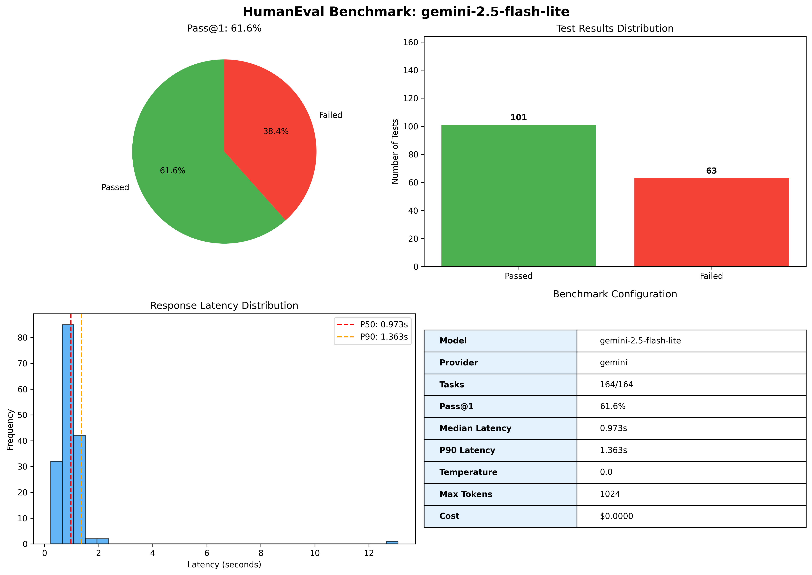
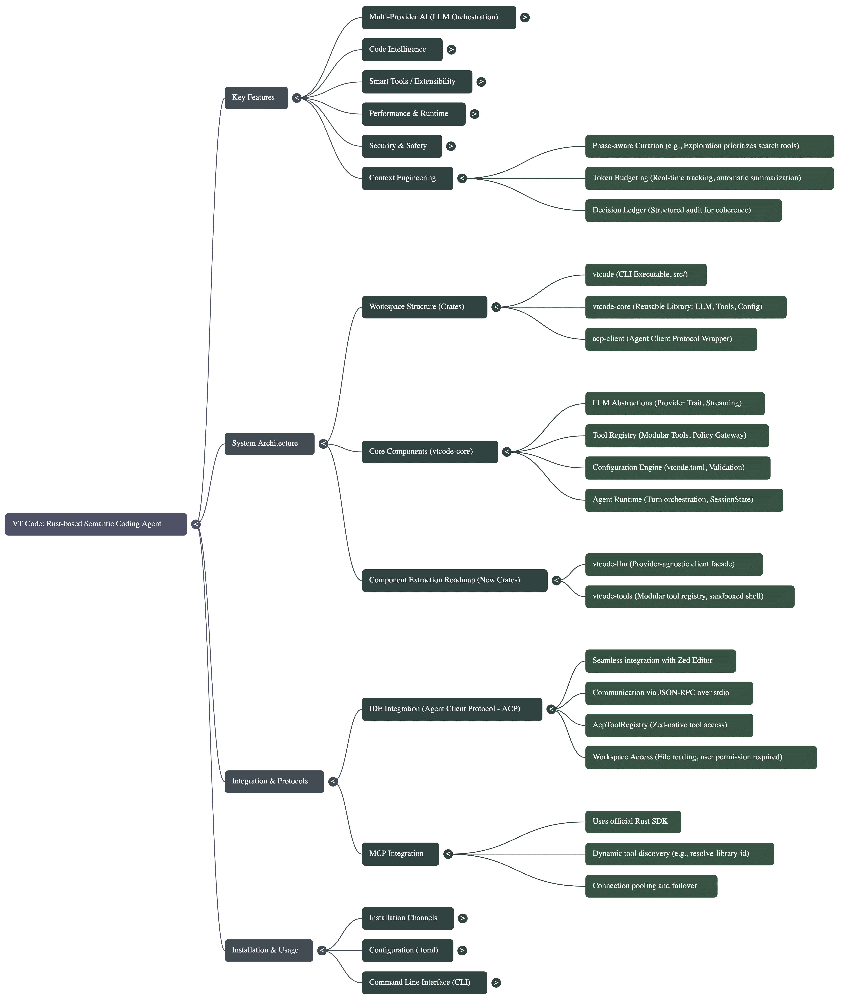

# VT Code

[](docs/benchmarks)

[](https://github.com/vinhnx/vtcode/blob/main/docs/guides/mcp-integration.md) [](https://agentclientprotocol.com/overview/agents)

[](https://crates.io/crates/vtcode) [](https://docs.rs/vtcode) [](https://www.npmjs.com/package/vtcode) [](https://deepwiki.com/vinhnx/vtcode)

---

`cargo install vtcode`

or `brew install vinhnx/tap/vtcode` (macOS)

or `npm install -g vtcode`

---

**VT Code** is a Rust-based terminal coding agent with semantic code intelligence via Tree-sitter (parsers for Rust, Python, JavaScript/TypeScript, Go, Java) and ast-grep (structural pattern matching and refactoring).

It supports multiple LLM providers: OpenAI, Anthropic, xAI, DeepSeek, Gemini, OpenRouter, Z.AI, Moonshot AI, all with automatic failover, prompt caching, and token-efficient context management. Configuration occurs entirely through `vtcode.toml`, sourcing constants from `vtcode-core/src/config/constants.rs` and model IDs from `docs/models.json` to ensure reproducibility and avoid hardcoding.


## Benchmarks

VT Code is evaluated on the [HumanEval](https://github.com/openai/human-eval) benchmark to measure code generation capabilities across different models.

### Latest Results

**Model:** `gemini-2.5-flash-lite`  
**Date:** 2025-10-22  
**Tasks:** 164/164 (complete dataset)



| Metric | Value |
|--------|-------|
| **Pass@1** | **61.6%** |
| Tests Passed | 101/164 |
| Tests Failed | 63/164 |
| Median Latency | 0.973s |
| P90 Latency | 1.363s |
| Estimated Cost | $0.00 (free tier) |

> **Note:** Benchmarks run with `temperature=0.0` for reproducibility. See [reports/](reports/) for detailed results and [scripts/bench_humaneval.py](scripts/bench_humaneval.py) for the benchmark implementation.

### Running Benchmarks

```bash
# Run full HumanEval benchmark (164 tasks)
make bench-humaneval PROVIDER=gemini MODEL='gemini-2.5-flash-lite'

# Run with custom parameters
make bench-humaneval PROVIDER=openai MODEL='gpt-5' N_HE=50 SEED=42

# Generate visualization
python3 scripts/render_benchmark_chart.py reports/HE_*.json
```

For more details on benchmark methodology and results, see [docs/benchmarks/](docs/benchmarks/).

## Overview Mind Map



## Table of Contents

-   [Quick Start](#quick-start)
-   [Key Features](#key-features)
-   [Installation](#installation)
-   [Configuration](#configuration)
-   [Zed IDE Integration](#zed-ide-integration)
-   [Command Line Interface](#command-line-interface)
-   [System Architecture](#system-architecture)
-   [Component Extraction Roadmap](#component-extraction-roadmap)
-   [Development](#development)
-   [References](#references)

## Quick Start

```bash
# Install VT Code
cargo install vtcode

# Set up your API key
export OPENAI_API_KEY="your_api_key_here"

# Launch VT Code
vtcode

# Or run a single query
vtcode ask "Explain this Rust code"
```

## Key Features

-   **Multi-Provider AI**: Support for OpenAI, Anthropic, Gemini, xAI, DeepSeek, Z.AI, Moonshot AI, OpenRouter, and Ollama (local)
-   **Smart Tools**: Built-in code analysis, file operations, terminal commands, and refactoring tools
-   **Code Intelligence**: Tree-sitter parsers for Rust, Python, JavaScript/TypeScript, Go, Java
-   **High Performance**: Rust-based with async/await, multi-threading, and efficient context management
-   **Editor Integration**: Native support for Zed IDE via Agent Client Protocol (ACP)
-   **Security First**: Sandboxed execution with Anthropic sandbox runtime integration, path validation, and configurable safety policies
-   **Context Engineering**: Advanced token management, conversation summarization, and phase-aware curation
-   **Local AI Support**: Ollama integration for running local models with configurable endpoints
-   **Custom Prompt Registry**: Load Markdown prompts with placeholder arguments and trigger them via `/prompts:<name>` for repeatable workflows ([guide](docs/user-guide/custom-prompts.md))
-   **Documentation Optimized**: Enhanced build process for docs.rs compatibility

## Technical Motivation

VT Code is my own research and my own passion on how coding agents work. I choose to Rust because of its type safety, zero-cost abstractions, and async ecosystem for reliable, high-performance execution. Motivated by agentic AI research (e.g., Anthropic's context engineering principles), it integrates Tree-sitter for precise parsing and MCP for extensible tooling. This enables long-running sessions with maintained context integrity, error resilience, and minimal token overhead. Builds on foundational work like [perg](https://crates.io/crates/perg) while incorporating lessons from Anthropic's [Context Engineering](https://www.anthropic.com/engineering/effective-context-engineering-for-ai-agents) and [Building effective agents](https://www.anthropic.com/engineering/building-effective-agents) guide. Inspiration from OpenAI's [codex-cli](https://github.com/openai/codex).

## System Architecture

The architecture divides into `vtcode-core` (reusable library) and `src/` (CLI executable), leveraging Tokio for multi-threaded async runtime (`#[tokio::main(flavor = "multi_thread")]` for CPU-intensive tasks), anyhow for contextual error propagation, and clap for derive-based CLI parsing. Key design tenets include atomic operations, metadata-driven tool calls (to optimize context tokens), and phase-aware context curation.

### Core Components (`vtcode-core/`)

-   **LLM Abstractions (`llm/`)**:
    Provider traits enable uniform async interfaces:

    ```rust
    #[async_trait::async_trait]
    pub trait Provider: Send + Sync {
        async fn complete(&self, prompt: &str) -> anyhow::Result<Completion>;
        fn supports_caching(&self) -> bool;
    }
    ```

    Features: Streaming responses, model-specific optimizations (e.g., Anthropic's `cache_control: { ttl: "5m" }` for 5-minute TTL; OpenAI's `prompt_tokens_details.cached_tokens` reporting ~40% savings). Tokenization via Hugging Face `tokenizers` (with heuristic fallback when resources are unavailable) ensures accurate budgeting across models.

-   **Modular Tools (`tools/`)**:
    Trait-based extensibility:

    ```rust
    #[async_trait]
    pub trait Tool: Send + Sync {
        fn name(&self) -> &'static str;
        fn description(&self) -> &'static str;
        async fn execute(&self, args: serde_json::Value) -> anyhow::Result<serde_json::Value>;
    }
    ```

    Built-ins include `read_file` (chunked at 2000 lines, metadata-first), `ast_grep_search` (operations: search/transform/lint/refactor with preview_only=true), and `run_terminal_cmd` (modes: terminal/pty/streaming; 30s timeout default). Git integration via `list_files` uses `walkdir` with `ignore` crate for .gitignore-aware traversal and `nucleo-matcher` for fuzzy scoring.

-   **Configuration Engine (`config/`)**:
    Deserializes `vtcode.toml` into structs with validation:

    ```toml
    [context.curation]
    enabled = true
    max_tokens_per_turn = 100000  # Enforce per-provider limits
    phase_detection = true  # Auto-classify: exploration/implementation/etc.
    ```

    Sections cover agents, tools (allow/deny), MCP (provider URLs), caching (quality_threshold=0.7), and safety (workspace_paths, max_file_size=1MB).

-   **Context Engineering System**:
    Implements iterative, per-turn curation based on conversation phase detection (e.g., exploration prioritizes search tools). Token budgeting: Real-time tracking with Hugging Face `tokenizers` (~10μs/message with cached models, heuristics on failure), thresholds (0.75 warn/0.85 compact), and automatic summarization (LLM-driven, preserving decision ledger and errors; targets 30% compression ratio, saving ~29% tokens/turn). Decision ledger: Structured audit (`Vec<DecisionEntry>` with status: pending/in_progress/completed, confidence: 0-1). Error recovery: Pattern matching (e.g., parse failures) with fallback strategies and context preservation.

-   **Code Intelligence**:
    Tree-sitter integration for AST traversal (e.g., symbol resolution in `tools/ast_grep_search`); ast-grep for rule-based transforms:

    ```yaml
    # Example pattern in tool call
    pattern: "fn $NAME($PARAMS) { $BODY }"
    replacement: "async fn $NAME($PARAMS) -> Result<()> { $BODY.await }"
    ```

    Supports preview mode to avoid destructive applies.

-   **MCP Integration**:
    Client uses official Rust SDK for protocol-compliant calls:

    ```rust
    let client = McpClient::new("ws://localhost:8080");
    let docs = client.call("get-library-docs", json!({
        "context7CompatibleLibraryID": "/tokio/docs",
        "tokens": 5000,
        "topic": "async runtime"
    })).await?;
    ```

    Discovers tools dynamically (e.g., `mcp_resolve-library-id` for Context7 IDs, `mcp_sequentialthinking` for chain-of-thought reasoning with branch/revision support, `mcp_get_current_time` for timezone-aware ops). Connection pooling and failover for multi-provider setups.

### CLI Execution (`src/`)

-   **User Interface**: Ratatui for reactive TUI (mouse-enabled, ANSI escape sequences for colors: e.g., \x1b[34m for blue tool banners). Real-time PTY via `vte` crate for command streaming; slash commands parsed with fuzzy matching.
-   **Runtime**: Tokio executor handles concurrent tool calls; human-in-the-loop via confirmation prompts for high-risk ops (e.g., `rm -rf` denials).
-   **Observability**: Logs to file/console with structured format; metrics (e.g., cache hit rate, token usage) exposed via debug flags.

Performance notes: Multi-threaded Tokio reduces latency for I/O-bound tasks (~20% faster than single-thread); context compression yields 50-80% token savings in long sessions. See [docs/ARCHITECTURE.md](docs/ARCHITECTURE.md) for dependency graph and profiling data.

## Component Extraction Roadmap

We are in the process of extracting reusable subsystems from this workspace so other Rust agents can build on VT Code’s tooling without adopting the entire TUI. The initiative currently focuses on two prototype crates:

-   [`vtcode-llm`](vtcode-llm/): provider-agnostic client facade that unifies request/response handling across Gemini, OpenAI, Anthropic, xAI, DeepSeek, and Z.AI with streaming and function calling gated behind feature flags.
-   [`vtcode-tools`](vtcode-tools/): modular tool registry exposing sandboxed shell execution, AST/grep utilities, planners, and telemetry hooks with optional features for heavyweight dependencies.

Progress, open tasks, and release checklists live in [docs/component_extraction_plan.md](docs/component_extraction_plan.md) and the companion [docs/component_extraction_todo.md](docs/component_extraction_todo.md) tracker. We will publish pre-release versions of these crates once the documentation and policy adapters are decoupled; in the meantime, community feedback on the roadmap and desired integration points is welcome via issues or discussions.

## Key Capabilities

-   **LLM Orchestration**: Failover logic (e.g., Gemini primary, OpenAI fallback); reasoning control (low/medium/high effort via provider params); caching with quality gating (cache only >70% confidence, TTL=30 days). Supports latest models including GPT-5, Claude Sonnet 4.5, Grok 4, GLM 4.6, Kimi K2, Qwen3, and DeepSeek V3.2.
-   **Code Analysis & Editing**: Semantic search (AST-grep similarity mode, threshold=0.7); targeted edits (exact string match in `edit_file`, preserving whitespace); multi-file patches via `apply_patch`.
-   **Context & Session Management**: Phase-adaptive tool selection (e.g., validation phase favors `run_terminal_cmd` with `cargo test`); ledger injection for coherence (max 12 entries); summarization triggers at 20 turns or 85% budget.
-   **Extensibility**: Custom tools via trait impls; MCP for domain-specific extensions (e.g., library docs resolution: `resolve-library-id` → `get-library-docs` with max_tokens=5000).
-   **Security Posture**: Path validation (no escapes outside WORKSPACE_DIR); sandboxed network (curl HTTPS only, no localhost); allowlists (e.g., deny `rm`, permit `cargo`); env-var secrets (no file storage); Anthropic sandbox runtime integration for secure command execution.

### Anthropic Sandbox Runtime Integration

VT Code now includes integration with Anthropic's sandbox runtime (`srt`), providing enhanced security for command execution within the agent. The sandbox runtime creates a secure, isolated environment for running terminal commands with configurable permissions.

**Features:**

-   **Filesystem Permissions**: Restrict read/write access to project workspace with configurable allow/deny rules
-   **Network Access Control**: Domain-specific network access via allowlist management
-   **Sandbox Command Interface**: Interactive slash command `/sandbox` to manage sandbox settings
-   **Secure Execution**: Isolated command execution preventing unauthorized system access

**Installation:**

```bash
npm install -g @anthropic-ai/sandbox-runtime
```

**Usage:**

```text
/sandbox enable          # Enable sandboxed command execution
/sandbox disable         # Disable sandboxing
/sandbox status          # View current sandbox configuration
/sandbox allow-domain example.com    # Allow network access to a domain
/sandbox remove-domain example.com   # Remove domain from allowlist
```

## Installation

### Download Binaries

Pre-built binaries are available for:

-   **macOS**: aarch64/x86_64-apple-darwin
-   **Linux**: x86_64/aarch64-unknown-linux-gnu
-   **Windows**: x86_64-pc-windows-msvc

Download from [GitHub Releases](https://github.com/vinhnx/vtcode/releases/latest)

### Package Managers

```bash
# Cargo (recommended)
cargo install vtcode

# Homebrew (macOS)
brew install vinhnx/tap/vtcode

# NPM
npm install -g vtcode
```

### Publishing to GitHub Packages

To publish this package to GitHub Packages:

1. Ensure your GitHub personal access token has the required scopes: `write:packages`, `read:packages`, and `repo`
2. Set up your `.npmrc` with GitHub Packages authentication
3. Set your `GITHUB_TOKEN` environment variable
4. Run the release script: `./scripts/release.sh`

See the [npm directory README](npm/README.md) for detailed instructions or follow the GitHub documentation on [working with the npm registry](https://docs.github.com/en/packages/working-with-a-github-packages-registry/working-with-the-npm-registry).

## Configuration

### Environment Setup

```bash
# Set your API key (choose your provider)
export OPENAI_API_KEY="sk-..."           # OpenAI
export ANTHROPIC_API_KEY="sk-ant-..."    # Anthropic
export GEMINI_API_KEY="AIza..."          # Google Gemini
export XAI_API_KEY="xai-..."             # xAI
export DEEPSEEK_API_KEY="sk-..."         # DeepSeek
export ZAI_API_KEY="zai-..."             # Z.AI
export MOONSHOT_API_KEY="sk-..."         # Moonshot AI
export OPENROUTER_API_KEY="sk-or-..."    # OpenRouter

# Optional: Use .env file in your project root
echo "OPENAI_API_KEY=sk-..." > .env
```

### Configuration File

Create `vtcode.toml` in your project root:

```toml
[agent]
provider = "openai"                    # Choose your provider
default_model = "gpt-5"               # Latest model
api_key_env = "OPENAI_API_KEY"        # Environment variable

[tools]
default_policy = "prompt"             # Safety: "allow", "prompt", or "deny"

[tools.policies]
read_file = "allow"                   # Always allow file reading
write_file = "prompt"                 # Prompt before modifications
run_terminal_cmd = "prompt"           # Prompt before commands
```

### Usage Examples

```bash
# Launch interactive TUI
vtcode

# Single query with specific provider/model
vtcode --provider openai --model gpt-5 ask "Refactor this async function"
vtcode --provider anthropic --model claude-sonnet-4-5 ask "Analyze code complexity"
vtcode --provider xai --model grok-4 ask "Explain this Rust code"
vtcode --provider zai --model glm-4.6 ask "Review this implementation"
vtcode --provider ollama --model llama3:8b ask "Help with this code"

# Debug mode
vtcode --debug ask "Compute token budget for current context"
```

### Ollama Configuration

To use Ollama with VT Code, first ensure your Ollama server is running locally:

```bash
# Start Ollama server
ollama serve

# Pull a model you want to use (e.g., llama3, mistral, etc.)
ollama pull llama3:8b
```

Then configure VT Code to use Ollama in your `vtcode.toml`:

```toml
[agent]
provider = "ollama"                    # Ollama provider
default_model = "llama3:8b"           # Any locally available Ollama model
# Note: Ollama doesn't require an API key since it runs locally

[tools]
default_policy = "prompt"             # Safety: "allow", "prompt", or "deny"

[tools.policies]
read_file = "allow"                   # Always allow file reading
write_file = "prompt"                 # Prompt before modifications
run_terminal_cmd = "prompt"           # Prompt before commands
```

You can also use a custom Ollama endpoint by setting the `OLLAMA_BASE_URL` environment variable:

```bash
export OLLAMA_BASE_URL="http://localhost:11434"  # Default Ollama URL
vtcode --provider ollama --model mistral:7b ask "Explain this function"
vtcode --provider ollama --model gpt-oss-20b ask "Review this implementation"
```

## Agent Client Protocol

VT Code is now a fully functional agent client protocol client, works seamlessly with [Zed](https://zed.dev) through the **[Agent Client Protocol (ACP)](https://agentclientprotocol.com/)**, a standardized protocol for communication between code editors and AI coding agents. This integration provides:

-   **Native Editor Integration**: Access VT Code's AI assistant without leaving your editor
-   **File Context Awareness**: AI can read and analyze files directly from your workspace using ACP's file system capabilities
-   **Tool Integration**: Leverage VT Code's extensive tool ecosystem (code analysis, terminal commands, etc.) via ACP tool calls
-   **Multi-Provider Support**: Use any supported LLM provider (OpenAI, Anthropic, Gemini, etc.) within Zed
-   **Standardized Communication**: JSON-RPC over stdio ensures reliable, cross-platform compatibility

The ACP protocol decouples agents from editors, similar to how the Language Server Protocol (LSP) standardized language server integration, allowing both sides to innovate independently while giving developers the freedom to choose the best tools for their workflow.

### Prerequisites

-   **Zed Editor**: Version `v0.201` or newer with Agent Client Protocol enabled
-   **VT Code Binary**: Installed and accessible via `PATH` or absolute path
-   **Configuration**: A properly configured `vtcode.toml` with provider credentials

### ACP Protocol Compliance

VT Code implements the [Agent Client Protocol](https://agentclientprotocol.com/) specification, providing:

-   **JSON-RPC Communication**: Standardized message format over stdio transport
-   **Session Management**: Proper initialization and session setup as per ACP spec
-   **Tool Call Support**: Full implementation of ACP tool calling mechanisms
-   **File System Integration**: ACP-compliant file reading and workspace access
-   **Content Formatting**: Markdown-based content rendering for rich formatting
-   **Extensibility**: Support for custom ACP extensions and slash commands

The protocol assumes the user is primarily in their editor and wants to use agents for specific tasks, with agents running as sub-processes of the code editor.

#### Quick Setup Overview

1. **Install VT Code** (if not already installed)
2. **Configure ACP** in your `vtcode.toml`
3. **Register Agent** in Zed's settings
4. **Launch & Verify** the integration

### Step 1: Install VT Code

Choose your preferred installation method:

```bash
# Via Cargo (recommended for development)
cargo install vtcode

# Via Homebrew (macOS)
brew install vinhnx/tap/vtcode

# Via NPM
npm install -g vtcode
```

Verify installation:

```bash
vtcode --version
which vtcode  # Note the path for Zed configuration
```

### Step 2: Configure ACP in vtcode.toml

Create or update your `vtcode.toml` configuration:

```toml
# Basic ACP configuration
[acp]
enabled = true

# Zed-specific ACP settings
[acp.zed]
enabled = true
transport = "stdio"  # Communication method

# Tool permissions for Zed integration
[acp.zed.tools]
read_file = true      # Allow reading files from workspace
list_files = true     # Allow listing directory contents
# Additional tools can be configured in [tools.policies]

# Optional: Custom provider/model for Zed integration
[agent]
provider = "openai"                    # OpenAI provider
default_model = "gpt-5-codex"          # GPT-5 Codex model for coding tasks
api_key_env = "OPENAI_API_KEY"         # Environment variable
reasoning_effort = "high"              # High reasoning for complex coding tasks

# Optional: Tool policies for ACP
[tools.policies]
read_file = "allow"        # Always allow file reading
write_file = "prompt"      # Prompt before file modifications
run_terminal_cmd = "prompt" # Prompt before terminal commands
```

### Step 3: Register VT Code Agent in Zed

Add VT Code as a custom agent in Zed's settings (`~/.config/zed/settings.json`):

```jsonc
{
    "agent_servers": {
        "vtcode": {
            "command": "vtcode", // If vtcode is in PATH
            "args": ["acp"],
            "env": {
                "GEMINI_API_KEY": "your_api_key_here" // Optional: override env vars
            }
        }
    }
}
```

**Alternative configurations:**

```jsonc
// Using absolute path (recommended for reliability)
{
    "agent_servers": {
        "vtcode": {
            "command": "/home/user/.cargo/bin/vtcode",
            "args": ["acp", "--config", "/path/to/custom/vtcode.toml"]
        }
    }
}

// With custom environment variables
{
    "agent_servers": {
        "vtcode": {
            "command": "vtcode",
            "args": ["acp"],
            "env": {
                "OPENAI_API_KEY": "sk-...",
                "ANTHROPIC_API_KEY": "sk-ant-...",
                "GEMINI_API_KEY": "AIza..."
            }
        }
    }
}
```

**Find your vtcode path:**

```bash
which vtcode
# Common locations:
# - $HOME/.cargo/bin/vtcode (Cargo install)
# - /usr/local/bin/vtcode (Homebrew)
# - /usr/bin/vtcode (System package)
```

### Step 4: Launch and Use VT Code in Zed

1. **Open Agent Panel**: Press `Cmd-?` (macOS) or `Ctrl-?` (Linux/Windows)
2. **Create External Agent**: Click "Create External Agent" or use the `+` button
3. **Select VT Code**: Choose the `vtcode` entry from your configured agents
4. **Start Chatting**: The ACP bridge will spawn automatically

**Usage Examples:**

```text
# Reference files in your workspace
@src/main.rs Can you explain this function?

# Attach current buffer
[Attach current file] How can I optimize this code?

# Ask about project structure
What files should I modify to add authentication?

# Request code analysis
Analyze the performance bottlenecks in this codebase
```

**Available Features:**

-   **File Reading**: AI can read and analyze any file in your workspace
-   **Code Analysis**: Leverage VT Code's tree-sitter parsers for semantic understanding
-   **Tool Integration**: Access to terminal commands, code search, and refactoring tools
-   **Multi-Provider**: Switch between different LLM providers without restarting

#### Advanced Configuration

**Custom Models per Project:**

```toml
# In your project's vtcode.toml
[agent]
provider = "anthropic"
default_model = "claude-sonnet-4-5"
api_key_env = "ANTHROPIC_API_KEY"

# Or use OpenRouter for access to multiple providers
[agent]
provider = "openrouter"
default_model = "anthropic/claude-sonnet-4.5"
api_key_env = "OPENROUTER_API_KEY"
```

**Tool-Specific Configuration:**

```toml
# Enable specific tools for Zed integration
[acp.zed.tools]
read_file = true
list_files = true
ast_grep_search = true
run_terminal_cmd = false  # Disable terminal access for security

# Configure tool policies
[tools.policies]
read_file = "allow"
write_file = "deny"        # Prevent accidental file modifications
run_terminal_cmd = "deny"  # Block terminal commands in Zed
```

#### Troubleshooting

**Common Issues:**

1. **Agent Not Appearing**:

    - Verify `vtcode` is in your PATH: `which vtcode`
    - Check Zed settings syntax in `settings.json`
    - Restart Zed after configuration changes

2. **Connection Errors**:

    - Ensure ACP is enabled: `[acp] enabled = true` in `vtcode.toml`
    - Check transport method: `transport = "stdio"`
    - Verify API keys are set in environment variables

3. **Tool Access Issues**:
    - Review `[acp.zed.tools]` configuration
    - Check `[tools.policies]` for permission settings
    - Enable debug logging: `vtcode --debug acp`

**Debug Commands:**

```bash
# Test ACP connection
vtcode acp --debug

# Check configuration
vtcode --config /path/to/vtcode.toml --debug

# View ACP logs in Zed
# Command Palette → "dev: open acp logs"
```

**Verification Steps:**

1. ACP logs should show successful connection
2. Agent panel should display "VT Code" as available
3. File references (`@filename`) should work in chat
4. Tool calls should appear in ACP logs

**Additional Resources:**

-   [Agent Client Protocol Documentation](https://agentclientprotocol.com/) - Official ACP specification and guides
-   [Zed ACP Integration Guide](https://github.com/vinhnx/vtcode/blob/main/docs/guides/zed-acp.md) - Detailed VT Code + Zed setup
-   [ACP Schema Reference](https://agentclientprotocol.com/schema) - Complete protocol schema documentation

Configuration validation: On load, checks TOML against schema (e.g., model in `docs/models.json`); logs warnings for deprecated keys.

## Command Line Interface

### Basic Usage

```bash
# Interactive mode (TUI)
vtcode

**Interactive reference:** See [docs/user-guide/interactive-mode.md](docs/user-guide/interactive-mode.md) for keyboard shortcuts, quick commands, and background execution tips.

# Single query mode
vtcode ask "your question here"

# With specific provider and model
vtcode --provider openai --model gpt-5 ask "Refactor this code"
```

### Custom Prompts

Slash commands expose the custom prompt registry so you can turn Markdown snippets into reusable actions:

```text
/prompts            # List available prompts, descriptions, and argument hints
/prompts:review     # Expand the `review.md` prompt from your prompts directory
/prompts:plan FILE=src/lib.rs PRIORITY=high
```

Configure prompt directories and limits in [`vtcode.toml`](vtcode.toml.example) under `[agent.custom_prompts]`, then follow the [custom prompts guide](docs/user-guide/custom-prompts.md) for format details and placeholder rules.

### Command Options

```bash
vtcode [OPTIONS] <SUBCOMMAND>

SUBCOMMANDS:
    ask <QUERY>     Execute a single query with optional tool usage

OPTIONS:
    --provider <PROVIDER>    LLM provider (openai, anthropic, gemini, etc.)
    --model <MODEL>          Model ID (gpt-5, claude-sonnet-4-5, gemini-2.5-flash, etc.)
    --no-tools               Disable tool execution (analysis only)
    --debug                  Enable verbose logging and metrics
    --config <PATH>          Specify custom config file path
    --help                   Show help information
```

### Resume Sessions

-   `--resume` and `--continue` are **global flags** that must be used without a subcommand.
-   Run `vtcode --resume` to pick a session interactively, or `vtcode --resume <SESSION_ID>` to jump straight to a known session.
-   Use `vtcode --continue` to resume the most recent session automatically.
-   Combining these flags with a subcommand (for example, `vtcode chat --resume`) is rejected to prevent ambiguous behavior. Launch the resume action first, then start a new command if needed.

### Development Commands

```bash
# Release build and run
./run.sh

# Debug build and run
./run-debug.sh

# Quick compilation check
cargo check

# Run tests
cargo test
```

## Development

### Getting Started

```bash
# Clone the repository
git clone https://github.com/vinhnx/vtcode.git
cd vtcode

# Build the project
cargo build --release

# Run tests
cargo test

# Check code quality
cargo clippy
cargo fmt --check
```

### Development Practices

-   **Code Quality**: Use `cargo clippy` for linting and `cargo fmt` for formatting
-   **Testing**: Unit tests in `#[cfg(test)]` modules, integration tests in `tests/`
-   **Error Handling**: Uniform `anyhow::Result<T>` with descriptive context
-   **Documentation**: Rustdoc for public APIs, Markdown documentation in `./docs/`

### Contributing

We welcome contributions! Please read [CONTRIBUTING.md](CONTRIBUTING.md) for guidelines.

### Architecture Overview

The project is organized into two main components:

-   **`vtcode-core/`**: Reusable library with LLM providers, tools, and configuration
-   **`src/`**: CLI executable with TUI interface and command parsing

Key design principles:

-   **Type Safety**: Leverage Rust's type system for reliability
-   **Async Performance**: Tokio runtime for concurrent operations
-   **Modular Design**: Trait-based extensibility for tools and providers
-   **Configuration-Driven**: TOML-based configuration with validation

## References

-   **User Guides**: [Getting Started](docs/user-guide/getting-started.md), [Configuration](docs/config/).
-   **Technical Docs**: [Context Engineering](docs/context_engineering.md), [MCP Setup](docs/mcp_integration.md), [Prompt Caching](docs/tools/PROMPT_CACHING_GUIDE.md).
-   **API**: [vtcode-core](https://docs.rs/vtcode-core) (full crate docs).
-   **Changelog**: [CHANGELOG](CHANGELOG.md).

## Support VT Code Development

I build VT Code in my free time as a passion [project](https://github.com/vinhnx/vtcode?tab=readme-ov-file#technical-motivation) to research and explore how coding agents work in practice. If you find VT Code useful, please consider supporting my work with a coffee via
[BuyMeACoffee](https://www.buymeacoffee.com/vinhnx):

[](https://www.buymeacoffee.com/vinhnx)


Your support means the world to me, thank you!

## License

MIT License - [LICENSE](LICENSE) for full terms.
