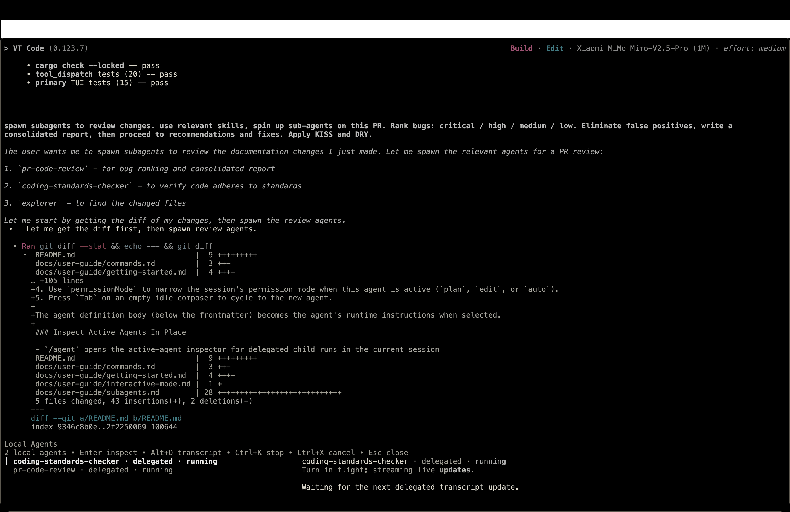
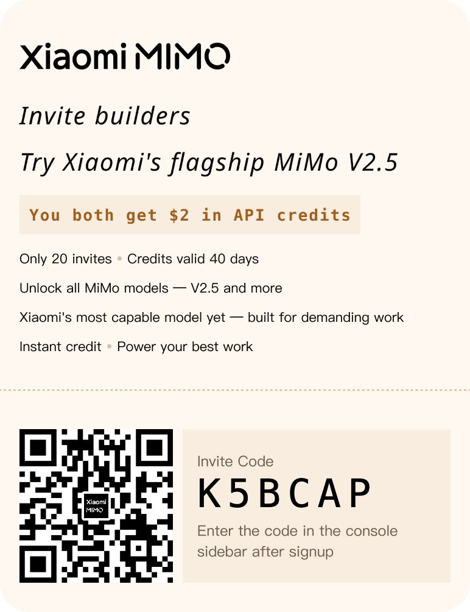
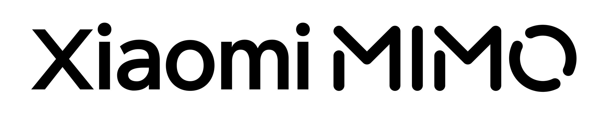

<p align="center">
  
</p>

<p align="center">
  <a href="./docs/skills/SKILLS_GUIDE.md"></a>
  <a href="./docs/guides/zed-acp.md"></a>
  <a href="./docs/guides/mcp-integration.md"></a>
  <a href="https://github.com/vinhnx/vtcode/releases"></a>
  <a href="https://github.com/vinhnx/vtcode/graphs/contributors"></a>
  <a href="https://github.com/sponsors/vinhnx"></a>
  <a href="https://deepwiki.com/vinhnx/VTCode"></a>
</p>

<p align="center">
  &nbsp;&nbsp;&nbsp;&nbsp;
  <br><em>Secure, open, universal.</em>
</p>

## What is VT Code?

VT Code is a local-first coding agent built in Rust, the only one with defense-in-depth security gating, broad LLM provider support, open protocols (Open Responses, A2A, MCP, ATIF), an extensible skill framework, delegated subagents, and rich tooling for long-running autonomous workflows.

## Features

<table style="border: none; border-collapse: collapse;">
  <tr>
    <td style="border: none; vertical-align: top; padding-right: 20px;"><strong>Agent runtime</strong><br><strong>Interactive TUI</strong>, slash commands, streaming, <code>ask</code>/<code>exec</code> CLI, session resume</td>
    <td style="border: none; vertical-align: top; padding-right: 20px;"><strong>Coding tools</strong><br>Safe file ops, ripgrep search, fuzzy discovery, code intelligence, project indexing, <strong>terminal execution</strong></td>
    <td style="border: none; vertical-align: top; padding-right: 20px;"><strong>Extensibility</strong><br><strong>Agent Skills</strong>, <strong>MCP</strong> client/server, lifecycle hooks, subagents, custom providers, Zed ACP, VS Code, Claude Code</td>
  </tr>
  <tr>
    <td style="border: none; vertical-align: top; padding-right: 20px; padding-top: 8px;"><strong>Model providers</strong><br>21+ LLM providers: <strong>Anthropic</strong>, <strong>OpenAI</strong>, <strong>Gemini</strong>, OpenRouter, Ollama, LM Studio, and more</td>
    <td style="border: none; vertical-align: top; padding-right: 20px; padding-top: 8px;"><strong>Safety</strong><br>Restricted shell sandbox, tool guardrails, subprocess isolation, <strong>full audit logging</strong></td>
    <td style="border: none; vertical-align: top; padding-top: 8px;"><strong>Protocols</strong><br><strong>Open Responses</strong>, <strong>Agent2Agent (A2A)</strong>, <strong>ATIF</strong>, Anthropic Messages API</td>
  </tr>
</table>

## Quick start

### Installing and running VT Code

```shell
curl -fsSL https://raw.githubusercontent.com/vinhnx/vtcode/main/scripts/install.sh | bash   # macOS / Linux (recommended)
```

```shell
brew install vinhnx/tap/vtcode    # via Homebrew (custom tap)
```

Then run `vtcode` to get started.

### Common commands

```shell
vtcode                        # launch interactive TUI
vtcode ask "explain Rc vs Arc"  # one-shot question, no tools
vtcode exec "refactor main.rs" # headless task with full tool access
vtcode review                  # review uncommitted changes
vtcode --resume                # pick up the last session
```

## Documentation

<table style="border: none; border-collapse: collapse;">
  <tr>
    <td style="border: none; vertical-align: top; padding-right: 20px;"><a href="./README.md#quick-start"><strong>Interactive TUI</strong></a><br>Primary agents, slash commands (<code>/model</code>, <code>/review</code>, <code>/mcp</code>, <code>/skills</code>, <code>/theme</code>, <code>/compact</code>, <code>/schedule</code>)</td>
    <td style="border: none; vertical-align: top; padding-right: 20px;"><a href="./docs/guides/full-automation.md"><strong>Full automation</strong></a><br><code>--full-auto</code> CLI, plan-build-evaluate harness, subagents, scheduled tasks</td>
    <td style="border: none; vertical-align: top; padding-right: 20px;"><a href="./docs/providers/PROVIDER_GUIDES.md"><strong>Providers</strong></a><br>Setup guides for all 21 providers</td>
  </tr>
  <tr>
    <td style="border: none; vertical-align: top; padding-right: 20px; padding-top: 8px;"><a href="./docs/config/CONFIG_FIELD_REFERENCE.md"><strong>Configuration</strong></a><br><code>vtcode.toml</code>, tool config, lifecycle hooks</td>
    <td style="border: none; vertical-align: top; padding-right: 20px; padding-top: 8px;"><a href="./docs/skills/SKILLS_GUIDE.md"><strong>Agent Skills</strong></a><br>Creating, loading, and sharing skills</td>
    <td style="border: none; vertical-align: top; padding-right: 20px; padding-top: 8px;"><a href="./docs/guides/mcp-integration.md"><strong>MCP Integration</strong></a><br>Client and server modes</td>
  </tr>
  <tr>
    <td style="border: none; vertical-align: top; padding-right: 20px; padding-top: 8px;"><a href="./docs/guides/zed-acp.md"><strong>Editor guides</strong></a><br>Zed ACP, VS Code, Claude Code</td>
    <td style="border: none; vertical-align: top; padding-right: 20px; padding-top: 8px;"><a href="./docs/safety/SAFETY_ARCHITECTURE.md"><strong>Safety</strong></a><br>Shell sandbox, security hardening, threat model</td>
    <td style="border: none; vertical-align: top; padding-top: 8px;"><a href="./docs/protocols/OPEN_RESPONSES.md"><strong>Protocols</strong></a><br>Open Responses, ATIF, A2A, Anthropic Messages API</td>
  </tr>
</table>

## Providers

VT Code supports 21 LLM providers out of the box, plus any OpenAI-compatible API via `[[custom_providers]]`.

### All providers

<table style="border: none; border-collapse: collapse;">
  <tr>
    <td style="border: none; vertical-align: top; padding-right: 20px;"><strong>Cloud LLMs</strong><br><a href="./docs/providers/PROVIDER_GUIDES.md#anthropic-claude"><strong>Anthropic Claude</strong></a> · <a href="./docs/providers/PROVIDER_GUIDES.md#openai-gpt"><strong>OpenAI</strong></a> · <a href="./docs/providers/PROVIDER_GUIDES.md#google-gemini">Gemini</a></td>
    <td style="border: none; vertical-align: top; padding-right: 20px;"><strong>Gateways</strong><br><a href="./docs/providers/PROVIDER_GUIDES.md#openrouter-marketplace">OpenRouter</a> · <a href="./docs/providers/PROVIDER_GUIDES.md#atlas-cloud">Atlas Cloud</a> · <a href="./docs/providers/PROVIDER_GUIDES.md#evolink-multi-model-gateway">Evolink</a></td>
    <td style="border: none; vertical-align: top; padding-right: 20px;"><strong>Local inference</strong><br><a href="./docs/providers/PROVIDER_GUIDES.md#ollama-local--cloud-models">Ollama</a> · <a href="./docs/providers/PROVIDER_GUIDES.md#lm-studio-local-server">LM Studio</a> · <a href="./docs/providers/PROVIDER_GUIDES.md#llamacpp-local-server">llama.cpp</a></td>
    <td style="border: none; vertical-align: top;"><strong>Other</strong><br><a href="./docs/providers/PROVIDER_GUIDES.md#github-copilot">GitHub Copilot</a> · <a href="./docs/providers/PROVIDER_GUIDES.md#anthropic-api-compatibility-server">Anthropic API Compat</a></td>
  </tr>
</table>

Read: [Provider Guides](./docs/providers/PROVIDER_GUIDES.md).

### Xiaomi MiMo V2.5 Series

<p align="center">
  <a href="https://platform.xiaomimimo.com"></a>
</p>

<p align="center">
  <a href="https://openrouter.ai/xiaomi/mimo-v2.5-pro">
    
  </a>
</p>

<p align="center"><em>Proud partner of the <a href="https://platform.xiaomimimo.com">Xiaomi MiMo Orbit Program</a></em></p>

Xiaomi MiMo V2.5 Pro ships as the default model in VT Code, available both natively and through OpenRouter. It brings a 1M-token context window, deep reasoning, and strong agentic performance to every session.

<table style="border: none; border-collapse: collapse;">
  <tr>
    <td style="border: none; vertical-align: top; padding-right: 20px;"><strong>Xiaomi MiMo</strong><br><code>mimo-v2.5-pro</code><br><code>mimo-v2.5</code><br><em>1M context</em></td>
    <td style="border: none; vertical-align: top;"><strong>OpenRouter</strong><br><code>xiaomi/mimo-v2.5-pro</code><br><code>xiaomi/mimo-v2.5</code><br><em>1M context</em></td>
  </tr>
</table>

Pricing: [Pay-as-you-go](https://platform.xiaomimimo.com/docs/en-US/price/pay-as-you-go) · [Subscription](https://platform.xiaomimimo.com/docs/en-US/price/tokenplan/subscription) · [Quick Access](https://platform.xiaomimimo.com/docs/en-US/price/tokenplan/quick-access) · [Docs](https://platform.xiaomimimo.com/docs/en-US/welcome) · [OpenRouter](https://openrouter.ai/xiaomi/mimo-v2.5-pro)

## Development

```shell
git clone https://github.com/vinhnx/vtcode.git
cd vtcode
./scripts/run-debug.sh
```

Rust stable, edition 2024, MSRV 1.88.

```shell
./scripts/check-dev.sh  # fast quality gate (clippy, fmt, check)
cargo nextest run        # parallel test runner
```

## Contributing

I'd love to have you, bug reports, docs, features, ideas, all welcome. Start with [issues](https://github.com/vinhnx/vtcode/issues) or [good first issues](https://github.com/vinhnx/vtcode/issues?q=is%3Aopen+is%3Aissue+label%3A%22good+first+issue%22). AI agents see [AGENTS.md](./AGENTS.md). Humans see [CONTRIBUTING.md](./docs/CONTRIBUTING.md).

<p align="center">
  <a href="https://github.com/oiwn"></a>&nbsp;
  <a href="https://github.com/chenrui333"></a>&nbsp;
  <a href="https://github.com/Sachin-Bhat"></a>&nbsp;
  <a href="https://github.com/leonj1"></a>&nbsp;
  <a href="https://github.com/gzsombor"></a>&nbsp;
  <a href="https://github.com/lucaszhu-hue"></a>&nbsp;
  <a href="https://github.com/poelzi"></a>&nbsp;
  <a href="https://github.com/EvoLinkAI"></a>&nbsp;
  <a href="https://github.com/gurdasnijor"></a>&nbsp;
  <a href="https://github.com/kernitus"></a>&nbsp;
  <a href="https://github.com/morler"></a>&nbsp;
  <a href="https://github.com/uiYzzi"></a>
</p>

## Support

VT Code is a labor of love built in my spare time. If it's helped you ship something or learn something, a [sponsorship](https://github.com/sponsors/vinhnx) would mean the world.

<p align="center">
  <a href="https://github.com/dnhn"></a>
  <a href="https://github.com/codemod"></a>
  <a href="https://github.com/coderabbitai"></a>
  <a href="https://github.com/KhaiRyth"></a>
</p>

<p align="center">
  <a href="https://github.com/sponsors/vinhnx"></a>&nbsp;&nbsp;&nbsp;
  <a href="https://buymeacoffee.com/vinhnx"></a>
</p>

## License

[MIT License](LICENSE).
