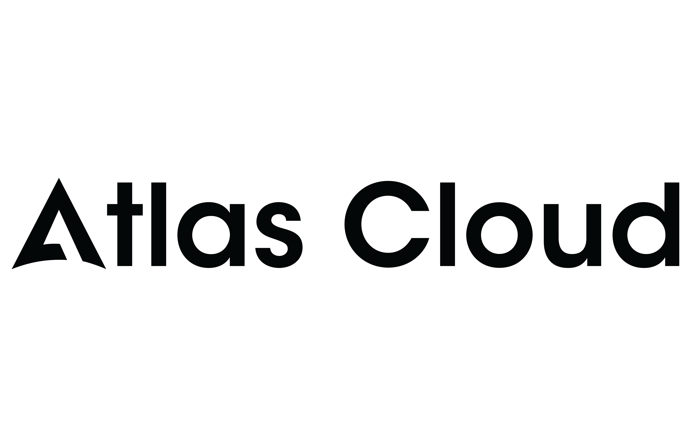

<div align="center">
  

  <p><strong>A Rust terminal coding agent with safe workspace tools, multi-provider LLM support, and open protocol integrations.</strong></p>

  <p>
    <a href="https://crates.io/crates/vtcode"></a>&nbsp;
    <a href="https://github.com/vinhnx/vtcode/releases"></a>&nbsp;
    <a href="./docs/skills/SKILLS_GUIDE.md"></a>&nbsp;
    <a href="./docs/guides/zed-acp.md"></a>&nbsp;
    <a href="./docs/guides/mcp-integration.md"></a>&nbsp;
    <a href="https://deepwiki.com/vinhnx/VTCode"></a>
  </p>

  
</div>

## Quick start

Set a provider key and launch VT Code in a project:

```bash
export ANTHROPIC_API_KEY="sk-..."
vtcode
```

Common commands:

```bash
vtcode ask "write a Rust factorial function" > factorial.rs
vtcode exec "summarize the current git diff"
vtcode --resume
```

## Features

| Area | What VT Code provides |
| --- | --- |
| Agent runtime | Interactive TUI, slash commands, streaming responses, non-interactive `ask` and `exec`, resume and continue, dynamic context curation |
| Coding tools | Safe file operations, patching, ripgrep search, fuzzy file discovery, syntax-aware code intelligence, project indexing, terminal execution |
| Model providers | GitHub Copilot, OpenAI, Anthropic, Gemini, DeepSeek, OpenRouter, Z.AI, Moonshot AI, MiniMax, Xiaomi MiMo, HuggingFace, Ollama, LM Studio, llama.cpp, custom OpenAI-compatible APIs |
| Extensibility | Agent Skills, MCP clients and server mode, lifecycle hooks, subagents, background subprocess agents, custom providers, editor integrations |
| Interoperability | Open Responses, Agent2Agent, Anthropic Messages API compatibility, ATIF trajectory export |
| Terminal UX | Rich TUI, mouse support, text selection, live command output, Ghostty VT snapshots with `legacy_vt100` fallback |

## Installation

### macOS and Linux

```bash
curl -fsSL https://raw.githubusercontent.com/vinhnx/vtcode/main/scripts/install.sh | bash
```

Skip optional search tools:

```bash
curl -fsSL https://raw.githubusercontent.com/vinhnx/vtcode/main/scripts/install.sh | bash -s -- --without-search-tools
```

### Windows PowerShell

```powershell
irm https://raw.githubusercontent.com/vinhnx/vtcode/main/scripts/install.ps1 | iex
```

> [!NOTE]
> Windows release artifacts are best-effort and may lag behind macOS/Linux builds.

### Package managers

```bash
cargo install vtcode
brew install vtcode

# Development tap
brew tap vinhnx/tap
brew install vinhnx/tap/vtcode
```

> [!TIP]
> Official macOS/Linux release archives include `ghostty-vt/` runtime libraries for richer PTY snapshots. Custom installs continue to work with the built-in `legacy_vt100` backend.

More details: [Installation Guide](./docs/installation/README.md), [Native Installer Guide](./docs/installation/NATIVE_INSTALLERS.md), [Ghostty VT Packaging](./docs/development/GHOSTTY_VT_PACKAGING.md).

## Providers

VT Code supports 21 LLM providers out of the box — from cloud APIs to local inference servers — plus any OpenAI-compatible API through `[[custom_providers]]`.

| Provider | Provider ID | Type |
| --- | --- | --- |
| OpenAI | `openai` | Cloud |
| Anthropic | `anthropic` | Cloud |
| Gemini | `gemini` | Cloud |
| DeepSeek | `deepseek` | Cloud |
| GitHub Copilot | `copilot` | Cloud |
| OpenRouter | `openrouter` | Cloud |
| Xiaomi MiMo | `mimo` | Cloud |
| Hugging Face | `huggingface` | Cloud |
| Z.AI | `zai` | Cloud |
| Moonshot | `moonshot` | Cloud |
| MiniMax | `minimax` | Cloud |
| Mistral | `mistral` | Cloud |
| Qwen | `qwen` | Cloud |
| StepFun | `stepfun` | Cloud |
| Evolink | `evolink` | Cloud |
| Poolside | `poolside` | Cloud |
| OpenCode Zen | `opencode-zen` | Cloud |
| OpenCode Go | `opencode-go` | Cloud |
| Ollama | `ollama` | Local |
| LM Studio | `lmstudio` | Local |
| llama.cpp | `llamacpp` | Local |
| Custom API | `[[custom_providers]]` | Any OpenAI-compatible |

For detailed setup guides, see [Provider Guides](./docs/providers/PROVIDER_GUIDES.md).

### Provider spotlight: Xiaomi MiMo V2.5 Series

> VT Code is happy to be part of the [Xiaomi MiMo Orbit Program](https://platform.xiaomimimo.com/)

<div align="center">
  <a href="https://platform.xiaomimimo.com"></a>
</div>

Xiaomi's MiMo V2.5 Pro is the default model in VT Code — available as the native MiMo provider and through OpenRouter. It delivers strong performance in agentic capabilities, complex software engineering, and long-horizon tasks with a 1M context window and deep reasoning.

<div align="center">
  <a href="https://openrouter.ai/xiaomi/mimo-v2.5-pro">
    
  </a>
</div>

| Provider | Model ID | Context |
| --- | --- | --- |
| [OpenRouter](https://openrouter.ai/xiaomi/mimo-v2.5-pro) | `xiaomi/mimo-v2.5-pro` | 1M tokens |
| OpenRouter | `xiaomi/mimo-v2.5` | 1M tokens |
| [Xiaomi MiMo](https://platform.xiaomimimo.com/docs/en-US/welcome) | `mimo-v2.5-pro` | 1M tokens |
| Xiaomi MiMo | `mimo-v2.5` | 1M tokens |

Pricing: [Pay-as-you-go](https://platform.xiaomimimo.com/docs/en-US/price/pay-as-you-go) · [Subscription](https://platform.xiaomimimo.com/docs/en-US/price/tokenplan/subscription) · [Quick Access](https://platform.xiaomimimo.com/docs/en-US/price/tokenplan/quick-access)

Read: [Xiaomi MiMo documentation](https://platform.xiaomimimo.com/docs/en-US/welcome) | [OpenRouter models](https://openrouter.ai/xiaomi/mimo-v2.5-pro).

### Atlas Cloud

[Atlas Cloud](https://atlascloud.ai) is an LLM provider accessible through VT Code's `[[custom_providers]]` support — no dedicated runtime provider needed.

```toml
[agent]
provider = "atlascloud"
default_model = "deepseek-ai/DeepSeek-V3-0324"

[[custom_providers]]
name = "atlascloud"
display_name = "Atlas Cloud"
base_url = "https://api.atlascloud.ai/v1"
api_key_env = "ATLASCLOUD_API_KEY"
model = "deepseek-ai/DeepSeek-V3-0324"
```

<div align="center">
  
</div>

Other custom OpenAI-compatible providers use the same `[[custom_providers]]` pattern.

Recommended validated Atlas chat model pool examples for `default_model` or
`vtcode ask --model <model-id>` include:

- `deepseek-ai/DeepSeek-V3-0324`
- `deepseek-ai/deepseek-r1-0528`
- `moonshotai/Kimi-K2-Instruct`
- `Qwen/Qwen3-Coder`
- `google/gemini-2.5-flash`
- `openai/gpt-5.2-chat`
- `anthropic/claude-opus-4.5-20251101`
- `zai-org/glm-4.7`
- `minimaxai/minimax-m2.1`
- `xai/grok-4-0709`

## Configuration

VT Code reads configuration from `vtcode.toml` in your project root. The default agent uses the MiMo provider with `mimo-v2.5-pro` as the default model.

```toml
[agent]
provider = "openai"
default_model = "gpt-5.4"
```

Useful configuration docs:

- [Configuration Precedence](./docs/config/CONFIGURATION_PRECEDENCE.md)
- [Config Field Reference](./docs/config/CONFIG_FIELD_REFERENCE.md)
- [Tool Configuration](./docs/config/TOOLS_CONFIG.md)
- [Lifecycle Hooks](./docs/guides/lifecycle-hooks.md)

## Extension points

### Skills

VT Code discovers repository, user, admin, and bundled system skills using the open Agent Skills `SKILL.md` format.

```bash
vtcode skills list
vtcode skills info my-skill
vtcode skills create my-skill
vtcode skills validate ./.agents/skills/my-skill
```

Read: [Agent Skills Guide](./docs/skills/SKILLS_GUIDE.md).

### MCP

VT Code ships as both an MCP client and server:

- **Client**: connect to any MCP server for tools like Figma, Playwright, Sentry, and more.
- **Server**: expose VT Code tools to external agents and editors.

Read: [MCP Integration](./docs/guides/mcp-integration.md).

### Agents and editors

- **Zed**: native ACP support with project-wide indexing.
- **VS Code / Copilot**: use the `vtcode ask` CLI or background agent mode.
- **Claude Code**: VT Code can operate as a subagent under `claude`.

Read: [Zed ACP Guide](./docs/guides/zed-acp.md), [VS Code Guide](./docs/guides/vscode.md), [Claude Code Guide](./docs/guides/claude-code.md).

## Safety model

VT Code runs a read-restricted shell. Every command passes through a sandbox that can block dangerous operations, log activity, and enforce policy.

| Layer | Behavior |
| --- | --- |
| Shell sandbox | Restricts commands to a safe subset; dangerous patterns are blocked |
| Tool guardrails | File operations are scoped to the project directory |
| Subprocess isolation | Background agents run in bounded, supervised subprocesses |
| Audit logging | All tool calls are logged for review |

Read: [Safety Architecture](./docs/safety/SAFETY_ARCHITECTURE.md), [Security Hardening](./docs/safety/SECURITY_HARDENING.md), [Threat Model](./docs/safety/THREAT_MODEL.md).

## Protocols and exports

| Protocol | Purpose | Docs |
| --- | --- | --- |
| Open Responses | OpenAI-compatible response format | [Open Responses](./docs/protocols/OPEN_RESPONSES.md) |
| ATIF | Standardized session trajectory export | [ATIF Trajectory Format](./docs/protocols/ATIF_TRAJECTORY_FORMAT.md) |
| A2A | Agent discovery, task lifecycle, streaming, JSON-RPC | [A2A Protocol](./docs/a2a/a2a-protocol.md) |
| Anthropic Messages API | Compatibility server for Anthropic-style clients | [Provider Guides](./docs/providers/PROVIDER_GUIDES.md#anthropic-api-compatibility-server) |

## Benchmarks

VT Code has a pending submission to [vercel/next-evals-oss](https://github.com/vercel/next-evals-oss/pull/83), the benchmark behind the [Next.js AI Agent Evaluations leaderboard](https://nextjs.org/evals).

| Agent | Model | Status | Success Rate | Passed | Avg Duration |
| --- | --- | --- | --- | --- | --- |
| VT Code | MiMo V2.5 Pro | Pending | -- | -- | -- |
| Claude Code | Claude Sonnet 4 | Published | 72.7% | 24/33 | 173s |
| Codex CLI | o3 | Published | 66.7% | 22/33 | 234s |
| Copilot | Claude Sonnet 4 | Published | 63.6% | 21/33 | 244s |
| Gemini CLI | Gemini 3 Flash | Published | 51.5% | 17/33 | 173s |
| OpenAI Codex | o3 | Published | 48.5% | 16/33 | 221s |
| Aider | Gemini 3 Pro | Published | 45.5% | 15/33 | 228s |

## Development

```bash
git clone https://github.com/vinhnx/vtcode.git
cd vtcode
./scripts/run-debug.sh
```

VT Code uses Rust stable, edition 2024, and MSRV 1.88. The dev profile disables incremental compilation (sccache). Set `CARGO_INCREMENTAL=1` to override.

**Local checks:**

```bash
./scripts/check-dev.sh             # fast gate (clippy, fmt, check)
./scripts/check-dev.sh --test      # + unit and integration tests
./scripts/check-dev.sh --workspace # + all workspace crates
./scripts/check-dev.sh --lints     # + additional lints
```

**Running tests:**

```bash
cargo nextest run                   # parallel runner (preferred)
cargo nextest run -p vtcode-core    # single crate
cargo nextest run test_name         # single test by name
```

**Launching VT Code:**

```bash
./scripts/run-debug.sh   # debug build + launch
./scripts/run.sh         # release build + launch
```

Both auto-bootstrap the Ghostty VT runtime. Without it, PTY snapshots fall back to `legacy_vt100`.

Read: [Development Setup](./docs/development/DEVELOPMENT_SETUP.md), [Testing](./docs/development/testing.md), [CI/CD](./docs/development/ci-cd.md).

## Contributing

Contributions are welcome -- typos, docs, bugs, code, ideas. Start with [open issues](https://github.com/vinhnx/vtcode/issues) or [good first issues](https://github.com/vinhnx/vtcode/issues?q=is%3Aopen+is%3Aissue+label%3A%22good+first+issue%22). For AI agents, read [AGENTS.md](./AGENTS.md) first. Humans should also read [CONTRIBUTING.md](./docs/CONTRIBUTING.md).

## Support

VT Code is built in my spare time and shared freely with the community. If it helps you ship code, learn, experiment with agents, or save a few hours, a small donation helps me keep improving it.

You can support ongoing development at [buymeacoffee.com/vinhnx](https://buymeacoffee.com/vinhnx). Stars, issues, feedback, and word of mouth also mean a lot.

<div align="center">
  
</div>

## Star History

If you find VT Code useful, please consider starring the repository. It helps more developers discover the project and gives the community a visible signal that the work is valuable.

[](https://www.star-history.com/#vinhnx/vtcode&type=timeline&legend=top-left)

## License

This repository is licensed under the [MIT License](LICENSE).
