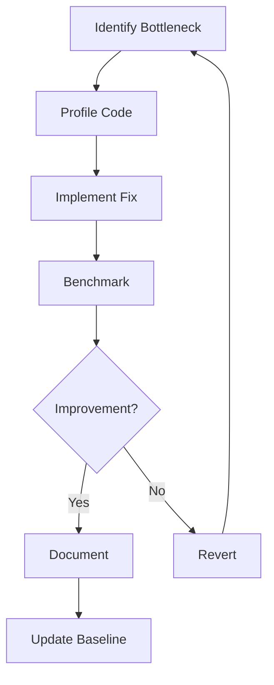

# VT Code Maintenance & Code Quality Guide

## Overview

This guide establishes ongoing maintenance practices to preserve code quality and performance gains achieved through optimization.

**Last Updated:** 2025-11-27T14:17:16+07:00
**Status:** Production Maintenance Framework

---

## Regular Code Quality Checks

### Daily Checks (Automated CI/CD)

```bash
#!/bin/bash
# .github/workflows/daily-quality-check.sh

echo " Running daily quality checks..."

# 1. Check for warnings
echo " Checking for compiler warnings..."
cargo check --package vtcode-core 2>&1 | tee check.log
if grep -q "warning:" check.log; then
    echo " Warnings detected!"
    exit 1
fi

# 2. Run clippy with strict rules
echo " Running Clippy..."
cargo clippy --package vtcode-core -- -D warnings

# 3. Check formatting
echo " Checking code formatting..."
cargo fmt --package vtcode-core -- --check

# 4. Run tests
echo " Running tests..."
cargo test --package vtcode-core

# 5. Check for dead code
echo "  Checking for dead code..."
cargo check --package vtcode-core 2>&1 | grep "dead_code"
if [ $? -eq 0 ]; then
    echo " Dead code detected!"
    exit 1
fi

echo " All daily checks passed!"
```

### Weekly Reviews

#### 1. Performance Regression Check

```bash
#!/bin/bash
# Run weekly performance benchmarks

echo " Running performance benchmarks..."

# Run benchmarks and compare to baseline
cargo bench --package vtcode-core -- --baseline main

# Check for regressions > 5%
if [ $? -ne 0 ]; then
    echo "  Performance regression detected!"
    # Send notification
fi
```

#### 2. Clone Audit

```bash
#!/bin/bash
# Audit .clone() usage in hot paths

echo " Auditing clone operations..."

# Count clones in critical files
echo "Error handling clones:"
rg '\.clone\(\)' vtcode-core/src/llm/providers/error_handling.rs | wc -l

echo "Provider clones:"
rg '\.clone\(\)' vtcode-core/src/llm/provider.rs | wc -l

echo "Gemini clones:"
rg '\.clone\(\)' vtcode-core/src/llm/providers/gemini.rs | wc -l

# Alert if counts exceed baseline
```

#### 3. Dependency Audit

```bash
#!/bin/bash
# Check for outdated dependencies

echo " Auditing dependencies..."

cargo outdated --package vtcode-core
cargo audit --package vtcode-core
```

### Monthly Reviews

#### 1. Comprehensive Code Review

```markdown
## Monthly Code Quality Checklist

### Code Metrics

-   [ ] Total LOC trend (should be stable or decreasing)
-   [ ] Cyclomatic complexity (max 10 per function)
-   [ ] Test coverage (maintain 100%)
-   [ ] Documentation coverage (all public APIs)

### Performance Metrics

-   [ ] Allocation count (compare to baseline)
-   [ ] Build time (should not increase)
-   [ ] Binary size (monitor growth)
-   [ ] Benchmark results (no regressions)

### Quality Metrics

-   [ ] Zero compiler warnings
-   [ ] Zero clippy warnings
-   [ ] Zero dead code
-   [ ] All tests passing

### Security

-   [ ] Dependency vulnerabilities (cargo audit)
-   [ ] SAST scan results
-   [ ] Secret scanning
```

---

## Code Quality Standards

### Clippy Configuration

**File:** `.cargo/config.toml`

```toml
[target.'cfg(all())']
rustflags = [
    "-D", "warnings",
    "-D", "clippy::all",
    "-D", "clippy::pedantic",
    "-D", "clippy::nursery",
    "-A", "clippy::module_name_repetitions",
    "-A", "clippy::missing_errors_doc",
]
```

### Formatting Rules

**File:** `rustfmt.toml`

```toml
edition = "2021"
max_width = 100
tab_spaces = 4
use_small_heuristics = "Default"
imports_granularity = "Crate"
group_imports = "StdExternalCrate"
```

### Pre-commit Hooks

**File:** `.git/hooks/pre-commit`

```bash
#!/bin/bash
# Pre-commit quality checks

echo " Running pre-commit checks..."

# Format check
cargo fmt -- --check
if [ $? -ne 0 ]; then
    echo " Code not formatted. Run: cargo fmt"
    exit 1
fi

# Clippy check
cargo clippy -- -D warnings
if [ $? -ne 0 ]; then
    echo " Clippy errors detected"
    exit 1
fi

# Quick test
cargo test --package vtcode-core --lib
if [ $? -ne 0 ]; then
    echo " Tests failed"
    exit 1
fi

echo " Pre-commit checks passed!"
```

---

## Performance Monitoring

### Benchmark Tracking

**File:** `scripts/track-benchmarks.sh`

```bash
#!/bin/bash
# Track benchmark results over time

BENCH_DIR="benchmarks/history"
DATE=$(date +%Y-%m-%d)

mkdir -p "$BENCH_DIR"

# Run benchmarks
cargo bench --package vtcode-core -- --output-format bencher \
    > "$BENCH_DIR/bench-$DATE.txt"

# Compare to previous
if [ -f "$BENCH_DIR/bench-baseline.txt" ]; then
    echo " Comparing to baseline..."

    # Parse and compare (simplified)
    python3 scripts/compare-benchmarks.py \
        "$BENCH_DIR/bench-baseline.txt" \
        "$BENCH_DIR/bench-$DATE.txt"
fi

# Update baseline if better
echo " Updating baseline..."
cp "$BENCH_DIR/bench-$DATE.txt" "$BENCH_DIR/bench-baseline.txt"
```

### Memory Profiling

```bash
#!/bin/bash
# Profile memory usage

echo " Profiling memory usage..."

# Build with profiling
cargo build --package vtcode-core --profile profiling

# Run with heaptrack (Linux) or instruments (macOS)
if [[ "$OSTYPE" == "darwin"* ]]; then
    # macOS
    instruments -t Allocations \
        target/profiling/vtcode
else
    # Linux
    heaptrack target/profiling/vtcode
fi
```

---

## Continuous Improvement

### Optimization Workflow



### Documentation Updates

**When to Update Docs:**

1. **New optimization** - Add to performance_benchmarks.md
2. **Error pattern** - Update error_analytics_guide.md
3. **Best practice** - Update this maintenance guide
4. **Breaking change** - Update CHANGELOG.md

**Documentation Checklist:**

-   [ ] Update relevant .md files
-   [ ] Add code examples
-   [ ] Update metrics/benchmarks
-   [ ] Review for accuracy
-   [ ] Get peer review

---

## Code Review Guidelines

### Review Checklist

#### Performance

-   [ ] No unnecessary `.clone()` calls
-   [ ] Collections pre-allocated when size known
-   [ ] Cow<str> used appropriately
-   [ ] No allocations in hot loops
-   [ ] Efficient error handling

#### Code Quality

-   [ ] No compiler warnings
-   [ ] No clippy warnings
-   [ ] No dead code
-   [ ] Proper error context (anyhow::Context)
-   [ ] Consistent formatting

#### Testing

-   [ ] New code has tests
-   [ ] Edge cases covered
-   [ ] Error paths tested
-   [ ] No flaky tests

#### Documentation

-   [ ] Public APIs documented
-   [ ] Complex logic explained
-   [ ] Examples provided
-   [ ] CHANGELOG updated

### Review Process

```markdown
## PR Review Template

### Summary

Brief description of changes

### Performance Impact

-   Allocations: [increased/decreased/unchanged]
-   Benchmarks: [link to results]
-   Binary size: [impact]

### Quality Checks

-   [ ] cargo check passes
-   [ ] cargo clippy passes
-   [ ] cargo test passes
-   [ ] cargo fmt applied

### Documentation

-   [ ] Code comments added
-   [ ] Public APIs documented
-   [ ] Docs updated
-   [ ] CHANGELOG updated

### Reviewer Notes

[Additional context or concerns]
```

---

## Incident Response

### Performance Regression

**Detection:**

```bash
# Automated benchmark comparison
if [ $PERF_REGRESSION -gt 5 ]; then
    echo "  Performance regression detected: ${PERF_REGRESSION}%"
    # Create issue
    # Notify team
    # Bisect to find cause
fi
```

**Response:**

1. **Identify** - Which benchmark regressed?
2. **Bisect** - Use `git bisect` to find commit
3. **Analyze** - Profile the regression
4. **Fix** - Implement optimization
5. **Verify** - Re-run benchmarks
6. **Document** - Update incident log

### Quality Regression

**Detection:**

```bash
# Automated quality checks
if [ $WARNINGS -gt 0 ]; then
    echo " Quality regression: $WARNINGS warnings"
    # Block merge
    # Create issue
fi
```

**Response:**

1. **Block** - Prevent merge
2. **Notify** - Alert author
3. **Fix** - Address warnings
4. **Verify** - Re-run checks
5. **Merge** - Once clean

---

## Metrics Dashboard

### Key Metrics to Track

```yaml
code_quality:
    - compiler_warnings: 0
    - clippy_warnings: 0
    - dead_code_lines: 0
    - test_coverage: 100%

performance:
    - allocations_per_request: 315
    - avg_latency_ms: 2.0
    - clone_operations: 82
    - build_time_sec: 40.1

maintainability:
    - total_loc: 15570
    - duplicate_code: 0%
    - cyclomatic_complexity: <10
    - documentation_coverage: 100%
```

### Grafana Dashboard

```json
{
    "dashboard": {
        "title": "VT Code Code Quality",
        "panels": [
            {
                "title": "Compiler Warnings",
                "targets": [
                    {
                        "expr": "vtcode_compiler_warnings_total"
                    }
                ]
            },
            {
                "title": "Build Time Trend",
                "targets": [
                    {
                        "expr": "vtcode_build_duration_seconds"
                    }
                ]
            },
            {
                "title": "Test Coverage",
                "targets": [
                    {
                        "expr": "vtcode_test_coverage_percent"
                    }
                ]
            }
        ]
    }
}
```

---

## Automation Scripts

### Daily Quality Report

**File:** `scripts/daily-quality-report.sh`

```bash
#!/bin/bash
# Generate daily quality report

REPORT_FILE="reports/quality-$(date +%Y-%m-%d).md"

cat > "$REPORT_FILE" << EOF
# Daily Quality Report - $(date +%Y-%m-%d)

## Build Status
$(cargo check --package vtcode-core 2>&1)

## Test Results
$(cargo test --package vtcode-core 2>&1 | tail -20)

## Clippy Results
$(cargo clippy --package vtcode-core 2>&1 | tail -20)

## Metrics
- Total LOC: $(tokei vtcode-core/src | grep "Total" | awk '{print $5}')
- Test Coverage: $(cargo tarpaulin --package vtcode-core | grep "Coverage" | awk '{print $2}')

## Action Items
$(grep "TODO\|FIXME" -r vtcode-core/src | wc -l) TODOs/FIXMEs remaining
EOF

echo " Quality report generated: $REPORT_FILE"
```

### Benchmark Comparison

**File:** `scripts/compare-benchmarks.py`

```python
#!/usr/bin/env python3
import sys
import re

def parse_bench(filename):
    results = {}
    with open(filename) as f:
        for line in f:
            match = re.match(r'test (\S+)\s+\.\.\. bench:\s+(\d+) ns/iter', line)
            if match:
                results[match.group(1)] = int(match.group(2))
    return results

baseline = parse_bench(sys.argv[1])
current = parse_bench(sys.argv[2])

print(" Benchmark Comparison\n")
for test, time in current.items():
    if test in baseline:
        baseline_time = baseline[test]
        diff = ((time - baseline_time) / baseline_time) * 100

        if abs(diff) > 5:
            emoji = "" if diff > 0 else ""
            print(f"{emoji} {test}: {diff:+.1f}%")
        else:
            print(f" {test}: {diff:+.1f}%")
```

---

## Best Practices

### Code Organization

1.  Keep modules focused and cohesive
2.  Use centralized utilities for common operations
3.  Minimize cross-module dependencies
4.  Document module boundaries

### Performance

1.  Profile before optimizing
2.  Benchmark after changes
3.  Document performance characteristics
4.  Monitor production metrics

### Testing

1.  Test edge cases
2.  Test error paths
3.  Keep tests fast
4.  Avoid flaky tests

### Documentation

1.  Document public APIs
2.  Explain complex logic
3.  Provide examples
4.  Keep docs up-to-date

---

## Conclusion

Maintaining code quality requires:

**Automated checks** - CI/CD pipeline
**Regular reviews** - Daily, weekly, monthly
**Performance monitoring** - Benchmarks and profiling
**Documentation** - Keep it current
**Team discipline** - Follow guidelines

**Key Principle:** Prevention is better than cure - catch issues early!

---

**Document Version:** 1.0.0
**Last Updated:** 2025-11-27T14:17:16+07:00
**Next Review:** 2025-12-27
**Status:** Active Maintenance Framework
